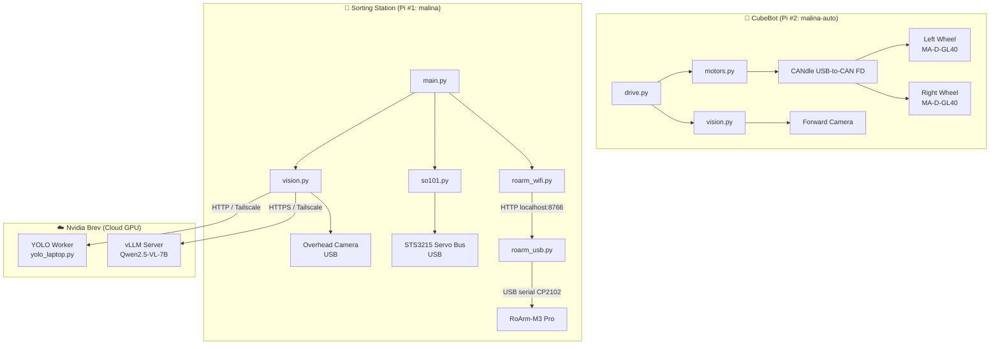

# Architecture

## System Overview

The system consists of **three compute nodes** connected via WiFi and Tailscale VPN:



## Communication Protocols

| Link | Protocol | Port | Auth |
|------|----------|------|------|
| Pi #1 → RoArm-M3 (USB) | USB serial (CP2102, 115200 baud) via `roarm_usb.py` | localhost:8766 | — |
| Pi #1 → RoArm-M3 (WiFi) | HTTP (`/js?json=...`) | 80 | None (local WiFi) |
| Pi #1 → SO-101 | USB Serial (Feetech STS3215 bus) | — | — |
| Pi #1 → Brev (LLM) | HTTPS (OpenAI-compatible) | 8000 | Bearer `$BREV_KEY` |
| Pi #1 → Brev (YOLO) | HTTP | 8000 | — |
| Pi #2 → Wheels | CAN FD via CANdle USB | — | — |
| Pi #2 camera stream | HTTP MJPEG (`stream.py`) | 8000 | — |
| Pi #1 ↔ Pi #2 | SSH / HTTP | 22 / custom | — |
| All ↔ Tailscale | WireGuard | — | Tailscale auth |

## Data Flow: Sort Cycle

```
1. SO-101 → "look" pose (camera above trash can)
2. USB Camera → capture frame
3. SO-101 → "stow" pose (out of RoArm's way)
4. Frame → Brev (Qwen2.5-VL-7B)
   → Returns: [{label, bin, x_pixel, y_pixel}, ...]
5. For each item:
   a. Homography: (x_px, y_px) → (x_mm, y_mm) in RoArm frame
   b. Reach check: is √(x² + y²) within [120, 380] mm?
   c. RoArm: approach → descend → grip → lift → move to bin → release
6. Repeat from 1 until no items picked
7. RoArm → park position
```

## Data Flow: Bottle Inspection (dorm_keeper)

```
1. SO-101 camera detects bottle on table (YOLO)
2. Wait for bottle to be stationary (1 second)
3. Homography: pixel → RoArm coordinates
4. RoArm grabs bottle from above
5. Camera verifies: is bottle still on table? (retry if grab failed)
6. RoArm presents bottle to SO-101 camera
7. SO-101 tracks bottle, reads barcode (zxing-cpp)
8. If no barcode: RoArm rotates bottle (up to 3 rotations)
9. Barcode → Kaucja.pl API → deposit eligible?
10. RoArm drops in "kaucja" or "inne" bin
```

## Data Flow: Navigation

```
1. Load route from config.json
2. For each step:
   a. {tag: N} → drive toward AprilTag N
      - Camera detects tag → compute heading error
      - Small error → arc (inner wheel slowed)
      - Large error → spin in place
      - Tag grows to stop_px → stop
   b. {drive: [L, R, T]} → blind timed move
      - Obstacle check still active for forward moves
   c. {sort: true} → run sort cycle
   d. {cmd: "..."} → shell command (e.g., SSH)
3. Obstacle detection runs continuously:
   - Learn floor colour from first clear frame
   - If corridor has non-floor pixels for N frames → halt
   - Wait until clear for N frames → resume
```

## Calibration Pipeline

```
1. Tape AprilTag 36h11 ID 0 on RoArm gripper
2. SO-101 → "look" pose
3. RoArm visits N calibration points at pick height
4. At each point: camera finds the tag → records (pixel, mm) pair
5. cv2.findHomography(pixels, millimeters) → 3×3 matrix H
6. H saved to config.json
7. At runtime: (u, v) → H × [u, v, 1]ᵀ → (x_mm, y_mm)
```

## Module Dependency Graph

```
main.py
├── roarm_wifi.py    (RoArm HTTP client → roarm_usb.py on localhost:8766)
├── so101.py         (SO-101 USB servo control)
└── vision.py        (camera, tags, homography, LLM)

roarm_usb.py         (USB serial ↔ HTTP bridge, serves /js on localhost:8766)

drive.py
├── motors.py        (CANdle wheel control)
└── vision.py        (camera, tags, obstacles)

stream.py            (live MJPEG camera view, imports vision + motors)

roarm_pick.py
├── roarm_wifi.py        (shared with Raspberry/)
└── so101_station.py HTTP (SO-101 via web API)

roarm_panel.py           (served by so101_station.py at /roarm_panel)
```
