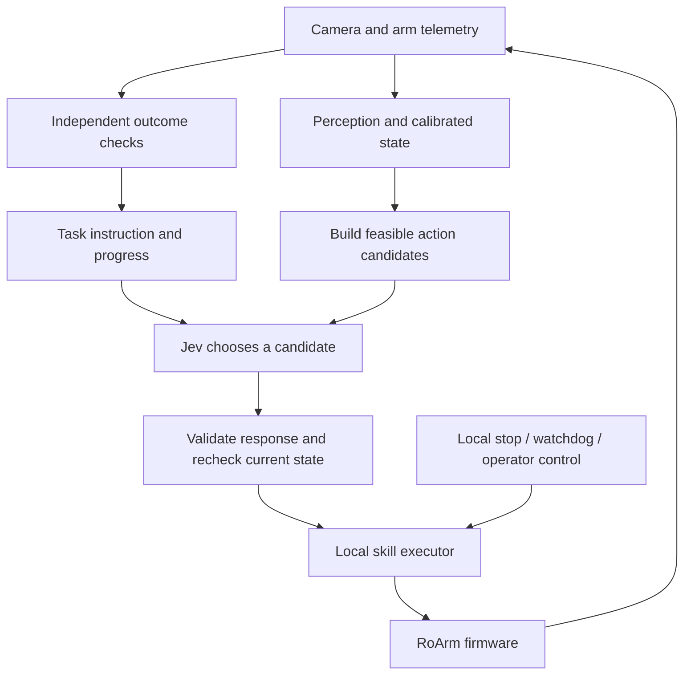

# Proposed robotics harness

Design proposal, not implemented. Grounding sources are in `research/FINDINGS.md`.

## First useful task

A tabletop kitting station using one RoArm-M3 Pro follower: put requested known, lightweight parts into a tray. Begin with easy-to-grasp printed parts in indexed nests, a fixed overhead camera and marked tray positions. Example instruction: “Make the bracket-and-cap kit; leave the spacer out.” Follow-up variants change the requested kit, substitute an allowed part, or encounter a missing part.

This makes physical reliability tractable while testing instruction-conditioned decisions. A fixed sorting script can do the fixed recipe; Jev must demonstrate value on changed instructions, ambiguity or recovery. Workpiece size, payload, fixture geometry and motion limits are TBD from the actual hardware—no invented capacities or coordinates.

## Separation of responsibilities

- **Perception:** detect marker/object IDs, track visible/occluded status and observe tray occupancy. Calibrate camera-to-table and table-to-arm transforms. Establish uncertainty and freshness. Use known nests first; add variable poses later.
- **State builder:** expose concise named facts, failed preconditions and recent outcomes. Compute distances, counts and geometry locally. Keep telemetry, perception confidence and model confidence separate.
- **Candidate builder:** creates immutable IDs for feasible skill/target combinations. No free-form motor commands from model output. Filter by current workspace, gripper and arm state before calling Jev.
- **Jev adapter:** select the next useful candidate or request re-observation/operator help. Begin with a single joint action choice so incompatible operation/target combinations cannot arise. Later parallel questions must remain independent or be explicitly conditional.
- **Executor:** owns calibration, trajectories, joint/rate limits, completion checks and command authority. One active executor owns the arm; autonomous commands and leader following must not compete.
- **Outcome observer:** verify pickup/placement from fresh sensor evidence. A gripper closing is not proof of a grasp. A command acknowledgement is not proof of arrival. Jev choosing DONE is not proof of task completion.
- **Supervisor:** local control continues to enforce limits if the cloud is unavailable. Holding, braking and torque-off behavior need physical validation; torque release can drop a load. Never issue unconditional “return home” during exception handling.

## Observation/action contract

Each observation has an epoch, monotonic capture timestamp, frame/calibration IDs, arm identity, firmware, sensor-validity flags, stable object IDs, task progress and active skill state. Each candidate carries an ID, skill ID, target ID, preconditions, observation epoch and a deadline. Internally retain physical geometry; send Jev semantic summaries relevant to its decision.

On return: validate finite probability fields and known IDs; check the exact candidate still exists; reject stale epochs or expired deadlines; recheck live preconditions; execute at most once using an action ID. No queued stale decisions, overlapping motion, blind retries or automatic resurrection of a failed action.

Model/API errors trigger an explicit wait/re-observe/operator state. The local stop mechanism cannot depend on a Jev response. Reported confidence is logged, then thresholds are selected on separate calibration data. Do not copy arbitrary threshold constants from a demo.

## Initial skills

`observe`, `pick_from_known_nest`, `place_in_known_tray_slot`, `verify_pick`, `verify_place`, `request_operator`, and a physically validated `stop_or_hold` operation. “Home” is a calibrated pose transition available only when its route is valid, not a universal error handler. Motion skills can initially be taught waypoints; learned policies are optional replacements behind the same contract.

Use a leader arm to record demonstrations once frame conventions, joint order, units, feedback and command ownership are verified. Preserve timestamps, camera frames, outcomes and intervention labels. Do not start with bimanual handoffs: first establish repeatable single-arm skills, then add a second arm and a shared-workspace scheduler.

## Where OpenSCAD helps

Use the maintained OpenSCAD workflow to design indexed part nests, calibration-board mounts, camera brackets and trays. Fit and print verification remain physical work. This ties the repository to the robot experiment without pretending it already has paying customers.

## Reactive steering extension

The [optical-flow and sensor-fusion proposal](research/OPTICAL_FLOW_AND_SENSOR_FUSION.md) adds an earlier non-contact alignment experiment. Jev may choose short, bounded steering intentions as well as task-level skills. Local visual servoing owns numerical alignment and timing; the same freshness, ownership and stop contracts apply. Start with one arm, wrist target tracking and overhead context; evaluate flow before committing to dedicated modules or bimanual fusion.

## Thor execution host

The user reports access to a Jetson Thor. The [Thor research plan](research/THOR_AND_JEV.md) proposes local perception, motion planning and optional learned skills alongside hosted Jev decisions. Keep a single local command arbiter and profile combined workloads. Actual host configuration and RoArm integration remain unverified; local Jev deployment is a future option with no verified release date.
