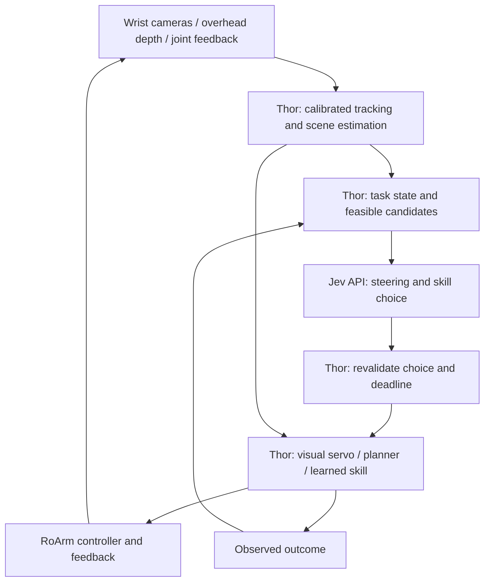

# Jetson Thor plus Jev: research and implementation priorities

September 17, 2026. User reports access to a Jetson Thor. Exact module, memory, installed software, camera interfaces and physical access remain unverified. This is a literature/documentation review and proposed design, not a Thor benchmark or an implemented RoArm integration. Paper abstracts, the ACT HTML paper, official repositories and NVIDIA documentation were reviewed; this is not an exhaustive literature survey or reproduction.

## Recommended division of work

Run camera processing, tracking, geometric estimation, local visual servoing, motion planning and eventually learned skill inference on Thor. Jev receives a compact observation and chooses a currently valid steering action, skill, target or recovery. The arm firmware remains responsible for its own servo execution; host compute does not replace validated firmware and communications-loss behavior.

The useful combination is a continuous local sensor/control loop plus asynchronous task decisions. Jev is not called for every camera frame. While a decision is pending, the local executor may continue only an already authorized bounded action with valid live preconditions; it cannot extend an action lease indefinitely. A delayed response is discarded when its candidate or observation expires. Local perception can request a new decision when a skill ends, visibility changes or progress stalls.

Example: Thor observes that a target has moved, tracks it and updates feasible approach options. Jev selects continued tracking or a different observation strategy. Thor computes and checks the actual motion, executes it, and reports measured progress. A learned policy could later implement the grasp skill behind that same interface.

## Most relevant papers and their role

Priority means our proposed implementation order, not a published ranking. None establishes RoArm compatibility or measured performance on our Thor.

| Technique and primary source | What it contributes | Proposed use and integration requirement |
| --- | --- | --- |
| [RAFT: Recurrent All-Pairs Field Transforms for Optical Flow](https://arxiv.org/abs/2003.12039), ECCV 2020 | Learned dense optical flow between image frames | Evaluate wrist-camera motion cues against a simpler feature tracker. Needs camera-motion compensation, depth/calibration for metric interpretation, and actual Thor profiling. Flow does not identify objects or prove contact. |
| [FoundationPose: Unified 6D Pose Estimation and Tracking of Novel Objects](https://arxiv.org/abs/2312.08344), CVPR 2024 | Estimates and tracks object position and orientation using object models or reference observations | Candidate for known printed parts once marker tracking works. Requires appropriate initialization, camera data and object assets. Useful for global reacquisition and orientation, rather than invoking full registration every frame. |
| [cuRobo: Parallelized Collision-Free Minimum-Jerk Robot Motion Generation](https://arxiv.org/abs/2310.17274), 2023 | GPU motion generation with parallel optimization and collision checking | Study the algorithms and integrate a compatible cuMotion release for approach/retract trajectories. Requires correct RoArm geometry, joint limits, tool geometry and controller interface. A planned collision-free path depends on the supplied world model. |
| [nvblox: GPU-Accelerated Incremental Signed Distance Field Mapping](https://arxiv.org/abs/2311.00626), 2023 | Incremental GPU volumetric mapping and obstacle-distance fields | Add when fixed table/fixture geometry is insufficient. Needs calibrated depth, robot masking and policies for moving objects and stale/unknown space. Never treat unseen space as proven empty. |
| [Learning Fine-Grained Bimanual Manipulation with Low-Cost Hardware](https://arxiv.org/abs/2304.13705), RSS 2023: ALOHA/ACT | Demonstration learning with action chunks and temporal ensembling | Particularly relevant to our recorded leader/follower setup. Collect synchronized RoArm-specific demonstrations and train bounded skills; Jev can choose skills and recoveries. ALOHA weights and embodiment are not automatically transferable. |
| [Diffusion Policy: Visuomotor Policy Learning via Action Diffusion](https://arxiv.org/abs/2303.04137), RSS 2023 | Predicts action sequences conditioned on observations using diffusion and receding-horizon execution | Later comparison to ACT for the same demonstrated skill. Requires a RoArm action representation, task data and profiling of inference plus control latency. Training feasibility on this Thor is unmeasured. |

RAFT and ACT are targeted experiments, not requirements to install every model. Optical flow, diffusion, and flow matching are different concepts; an action model does not replace the optical-flow estimator simply because its name contains “flow.”

## Concrete NVIDIA integration evidence

The [Isaac ROS 4.5 object-following tutorial](https://nvidia-isaac-ros.github.io/v/release-4.5/reference_workflows/isaac_for_manipulation/tutorials/tutorial_e2e.html) combines depth, nvblox, cuMotion and pose estimation on Thor. Its tested manipulators include UR5e/UR10e and Flexiv, not RoArm. It explicitly reduces perception input rates to avoid starving other GPU work. This supports a reference architecture, not a transferable throughput claim. Multi-camera reconstruction also does not mean object recognition is enabled on every camera.

The [Isaac ROS 4.5 platform matrix](https://nvidia-isaac-ros.github.io/v/release-4.5/repositories_and_packages/isaac_ros_common/index.html) lists Thor T5000/T4000 with JetPack 7.1 and ROS 2 Jazzy. This is one documented compatibility set, not a claim that 4.5 is the latest release or what is installed. Inventory the actual host before selecting a pinned stack.

The [current standalone cuMotion repository](https://github.com/nvidia-isaac/cumotion/) lists Thor distribution support. Its packaging/integration lifecycle differs from legacy cuRobo and the versioned Isaac ROS wrapper. Do not combine arbitrary latest components; verify the exact chosen release as a unit.

Follow the [custom-manipulator integration guide](https://nvidia-isaac-ros.github.io/v/release-4.5/concepts/manipulation/cumotion_moveit/tutorial_custom_manipulator.html) for robot descriptions and planning configuration. Local filename inspection found cuRobo examples in this repository, but did not establish a validated RoArm URDF/XRDF or working ROS control bridge. Example directories are not deployment evidence.

For object assets and the distinction between model-based and model-free initialization, consult the [FoundationPose author repository](https://github.com/NVlabs/FoundationPose). Our known printed parts give us a practical route to meshes; geometric symmetry, scale and initialization still need testing.

## Proposed runtime layout

Use one command arbiter for every policy. Jev, ACT and a planner must not independently command the arm. A learned skill's outputs pass through the same bounds, live-state checks and action lifetime rules. Neither perception confidence nor model confidence substitutes for outcome verification.

Run workloads at different cadences determined by measurement: persistent lightweight tracking; heavier detection/pose initialization on demand; map updates matched to scene change; planning when the target or path changes. Bound queues and prefer current sensor frames over growing stale backlogs. Avoid unnecessary GPU/CPU copies where the selected integration supports it. Record capture-to-decision and capture-to-actuation delay, not only inference FPS. Test combined load: a fast isolated model may become unusable beside mapping and planning.

## Jev hosted now, possible local backend later

The [documented Jev API](https://docs.typesafe.ai/api) provides a hosted endpoint. We have not verified downloadable weights, a Thor runtime or a release date for local Jev. Treat local availability as a future option rather than a dependency.

Define a backend-independent decision contract: observation epoch, task state, candidate IDs, deadline in; selected candidate, raw response/model version and timing out. A future local backend can implement that contract, but still needs separate accuracy, calibration, latency and concurrent-load evaluation. Changing deployment location does not eliminate model error or the need for local limits. Credentials remain private runtime inputs, never in this public folder.

## Proposed experiment sequence

1. **Inventory and replay:** identify Thor variant, JetPack/CUDA/runtime versions, power/cooling configuration and cameras. Replay a deliberately reviewed recording without motor authority. Establish a simple marker/feature-tracking baseline before adding neural perception.
2. **Perception comparison:** compare simple wrist tracking against RAFT-enhanced tracking; assess FoundationPose on known objects if orientation/reacquisition warrants it. Measure tracking loss, error and latency across height, rotation and occlusion. Use the sensor-fusion design's calibration requirements.
3. **Local controller first:** validate one-arm non-contact target alignment. Start with known workspace geometry. Introduce cuMotion only after validating RoArm kinematics and the control bridge; introduce nvblox when observed scene changes justify mapping.
4. **Hybrid Jev experiment:** same local executor and observations, deterministic supervisor versus Jev. Test target changes, temporary occlusion, task changes and recovery. Measure all attempts, interventions, expired choices and successful recovery, including GPU contention and network failure.
5. **Demonstration learning:** record leader/follower images, joint state, actions, timing and outcomes. Train one ACT skill before comparing Diffusion Policy. Keep training and held-out evaluation scenes distinct. Decide training hardware from a measured small trial, not Thor branding.
6. **Two arms:** expand only after stable single-arm behavior. Validate shared coordinates, collision geometry, arbitration and occlusion handling. Do not assume two independent planners yield a valid combined trajectory.

No purchases, host installation, model downloads, live inference or robot actuation occurred during this research. Baseline-first sequencing is intended to establish which added processing actually improves our task.
